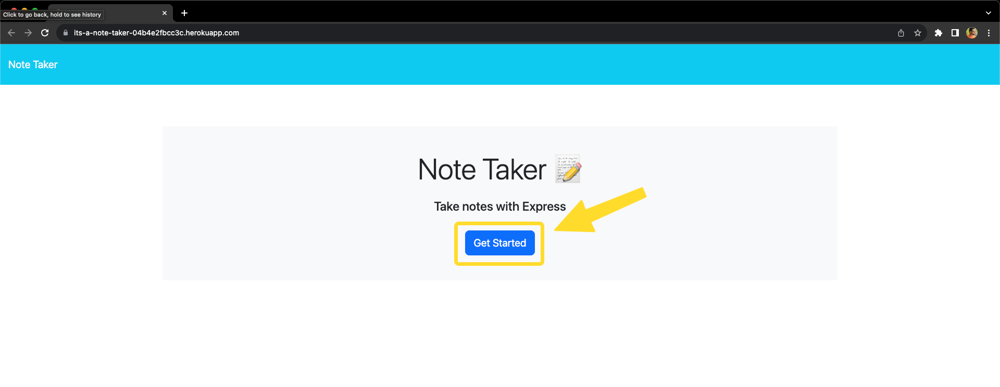
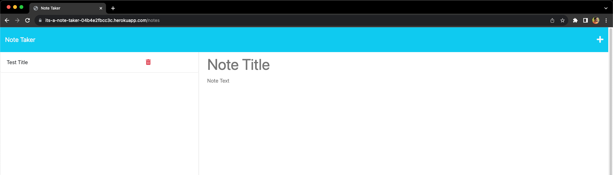
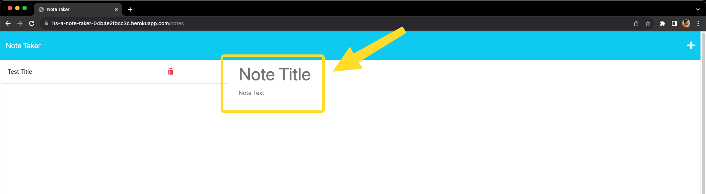
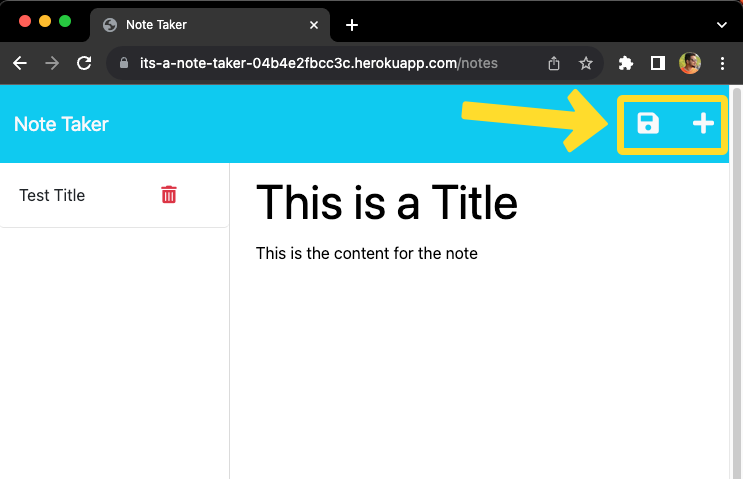
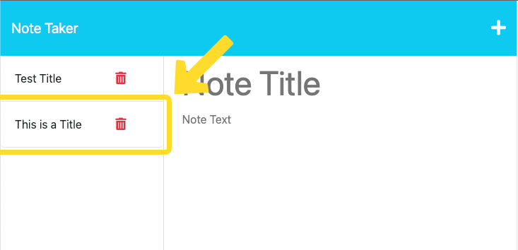
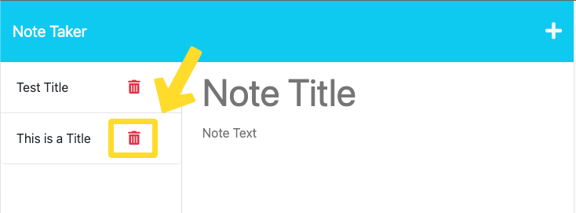

# Note-Taker

## Description

This app is used as a note taking app.

## Table of Contents

* [Installation](#installation)

* [Usage](#usage)

* [Credits](#credits)
  
* [License](#license)

* [Contributing](#contributing)

* [Questions](#questions)

## Installation

To install the necessary dependencies, run the following command:

npm i

## Usage 

When you load into the webpage you are greated with "Note Taker" heading and a "Get Started button". Click on the Get Started button to start.

Once you click on the button you are taken to notes page where you can begin note taking.

You can enter a title for you note in the "Note Title" section and the note content in the "Note Text" section.

Once you add the Note title and content you can click on the save icon on the top right corner of the page to save it to the notes list or can click on the plus icon to clear the entered content and enter a new note.

Once you save the note it will appear below the last added note (only title will be visible) on the left side list, you can click on it to view the content of the note.

Click on the delete icon corresponding to each note to delete it.

## Credits

N/A

## License

This project is licensed under the MIT license.

## Contributing

Anyone is free to contribute

## Questions

If you have any questions about the repo, open an issue or contact me directly at write2delvin@gmail.com. You can find more of my work at [delve-in](http://github.com/delve-in/).
